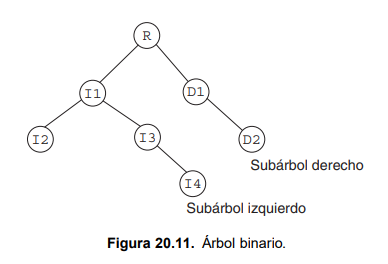
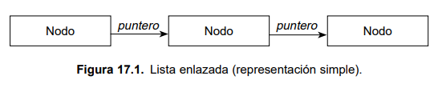
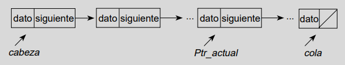

# Estructuras de datos Montículo y Lista Enlazada

> Paula Diaz Romero

## Introducción

**Tipo de dato**

En un lenguaje de programación, un tipo de datos de una variable está determinado por el conjunto de valores que dicha variable puede tomar y el conjunto de operaciones que se pueden realizaron con estas variables. Es una categoría que especifica la forma en que se interpreta el contenido almacenado en una variable, como enteros, caracteres o booleanos. (Señas y Martig, 2005; Sebesta, 2012)

Los tipos de datos fundamentales en lenguaje C son:

- **Enteros**: (números complejos y sus negativos) de tipo *int*.
- **Variantes de enteros**: tipo *short*, *long* y *unsigned*.
- **Reales**: números decimales de tipos *float*, *double* o *long double*.
- **Caracteres**: letras, dígitos, símbolos y signos de puntuación de tipo *char*.

*char*, *int*, *float* y *double* son palabras reservadas, o más específicamente, *especificadores de tipos*. Cada tipo de dato tiene su propia lista de atributos que definen las características del tipo y pueden variar de una máquina a otra. Los tipos *char*, *int* y *double* tienen variaciones o modificadores de tipos de datos tales como *short*, *long*, *signed* y *unsigned*, para permitir un uso más eficiente de los tipos de datos. (Aguilar y Martinez, 2002)

**Tipo de dato abstracto**

Se puede pensar en un tipo de dato abstracto (TDA) como un modelo matemático de datos que define un tipo de datos en términos de su comportamiento (operaciones que se pueden realizar sobre él). (Aho, Hopcroft y Ullman, 1988; Señas y Martig, 2005)

En relación con un TDA, se puede hablar de definirlo o implementarlo. Definir un TDA es dar un modelo y conjunto de operaciones correspondientes, por otro lado, implementar un TDA depende de quién tomará dicha descripción como base, encontrando una estructura de datos adecuada para representar el modelo subyacente del TDA y escribiendo los procedimientos (o funciones) que cumplirán al ejecutarse con las tareas propuestas por las operaciones.

Las definiciones de los TDA se hacen cuando se diseñan los algoritmos, mientras que cuando se implementas los algoritmos en un determinado lenguaje de porgramación es cuando se implementan los TDA que se han definido previamente. (Señas y Martig, 2005)

**Estructura de dato**

Para representar el modelo matemático básico de un TDA se emplean estructuras de datos, que son conjuntos de variables (del mismo tipo o no) conectadas entre sí de diversas formas. Es una forma particular de organizar y almacenar datos en un ordenador de manera que puedan ser utilizados de manera eficiente. 
Se considera a una celda como la unidad básica de una estructura de datos. Además de la capacidad propia de un lenguaje de programación para agrupar las celdas de una estructura de datos (por ejemplo arreglos, registros, etc.), existe la posibilidad de crear estructuras relacionando o enlazando celdas usando punteros. (Aho, Hopcroft y Ullman, 1988; Señas y Martig, 2005)

## Montículo binario

Un árbol consta de un conjunto finito de elemenos, denominados *nodos*, y un conjunto finito de líneas dirigidas, denominadas *ramas*, que conectan los nodos. Utilizando el concepto de árboles genealógicos, un nodo puede ser considerado *padre* (o raíz) si tiene nodos sucesores (hijos).

Un **árbol binario** es un árbol en el que ningún nodo puede tener más de dos subárboles. Cada nodo puede tener cero, uno o dos hijos. Se conoce el nodo de la izquierda como *hijo izquierdo* y el nodo de la derecha como *hijo derecho*. (Aguilar y Martinez, 2002)

Un **montículo binario** es una estructura de datos del tipo árbol con información permteneciente a un conjunto ordenado. Los **montículos máximos** tienen la característica de que cada nodo padre tiene un valor mayor que el de cualquiera de sus nodos hijos, mientras que en los **montículos mínimos**, el valor del nodo padre es siempre menor al de sus nodos hijos. (Moltó; Informática de Sistemas)

Para **insertar un nuevo nodo**, dado que los montículos se llenan por niveles, instertar un nuevo valor implica hacerlo en la última posición. En general, después de insertar un valor, el montículo pierde la propiedad de orden, de modo que ésta debera ser restaurada. Para ello, se compara la clave insertada con la del nodo padre, si no se cumple la propiedad de orden, se intercambian los valores. (Moltó)

De forma análoga, al **eliminar un nodo mínimo o máximo**, para mantener la propiedad de orden, se sustituirá el valor almacenado en el nodo a borrar por el último nodo del árbol. Esto elimina el último nodo y, como probablemente el montículo pierda orden, se deberán comparar las claves para restaurarlo. 

Para la implementación de un montículo binario utilizando un arreglo, cada dato leído se coloca en la primera posición libre del array. Al finalizar, se modifica la estructura con una función de orden que recorra el arreglo para que establezca la propiedad de orden. (Informática de Sistemas)

## Lista enlazada

Una lista enlazada es una colección o secuencia de elementos dispuestos uno detrás de otro, en la que cada elemento se conecta al siguiente elemento por un 'enlace' o 'puntero'. La idea básica consiste en construir una lista cuyos elementos llamados **nodos** se componen de dos partes o campos: la primera parte o campo contiene la información y es, por consiguiente, un valor de un tipo genérico y la segunda parte o campo es un puntero que apunta al siguiente elemento de la lista. (Aguilar y Martinez, 2002)

Una de las categorías de listas es la **lista simplemente enlazada**, donde cada nodo (elemento) contiene un único enlace que conecta al nodo siguiente. La lista es eficiente en recorridos directos.
Como dijimos anteriormente, la lista enlazada consta de un conjunto de nodos. Cada nodo consta de un campo de dato y un puntero que apunta al siguiente elemento de la lista.

El primero nodo, frente, es el nodo apuntado por la **cabeza**. La lista encadena nodos juntos desde el frente al final (**cola**) de la lista. El final se identifica como el nodo cuyo campo puntero tiene el valor NULL = 0. La lista se recorre desde el primero al último nodo; en cualquier punto del recorrido la posición actual se referencia por el puntero *Ptr_actual*. En el caso en que la lista no contiene un nodo, el puntero cabeza es nulo. (Aguilar y Martinez, 2002)

Dentro de las operaciones que podemos realizar con una lista, definiremos las siguientes:

- **Obtener cabeza**: Esta operación devuelve un puntero a la cabeza de la lista.

- **Obtener cola**: Esta operación devuelve un puntero a la cola de la lista.

- **Eliminar cabeza**: Esta operación elimina la cabeza de la lista, con lo cual el siguiente nodo (si existe) se convierte en la nueva cabeza.

## Referencias

- Perla Señas y Sergio Martig (2005). *Estructuras de datos y algoritmos.* http://www.cs.uns.edu.ar/~ldm/data/eda/apuntes/01_td-ed-tda.pdf

- Alfred V. Aho, John E. Hopcroft, Jefrey De. Ullman (1988). *Estructuras de datos y algoritmos.* 

- Robert W. Sebesta (2012). *Concepts of Programming Languages* (10ma edición).

- Luis Joyanes Aguilar, Ignacio Zahonero Martinez (2002). *Programación en C*.

- Germán Moltó. *Implementación de Cola de Prioridad y Ordenación Rápida según un Montículo Binario*. Universidad Politécnica de Valencia. https://www.grycap.upv.es/gmolto/docs/eda/EDA_Tema_12_gmolto.pdf

- *Estructuras de Datos*. I. T. Informática de Sistemas. https://www.infor.uva.es/~cvaca/asigs/monticulos.pdf